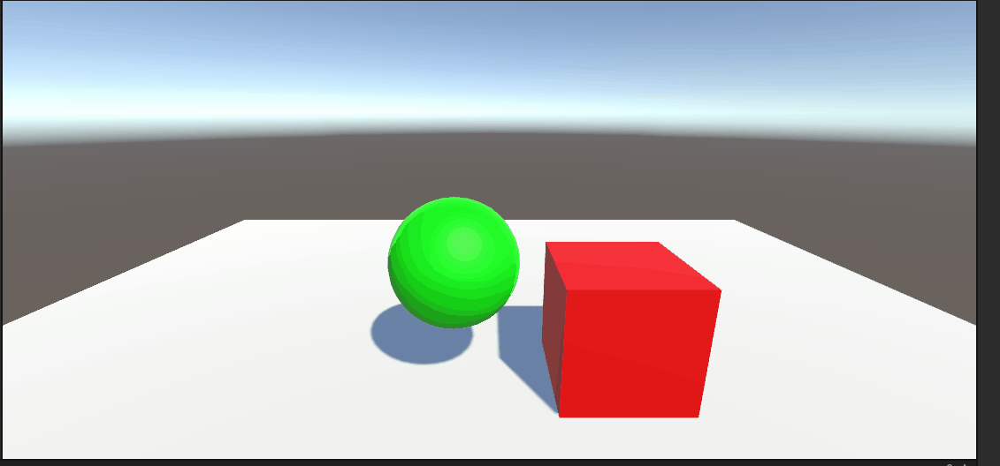
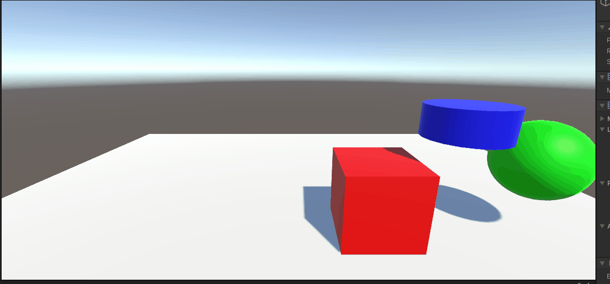
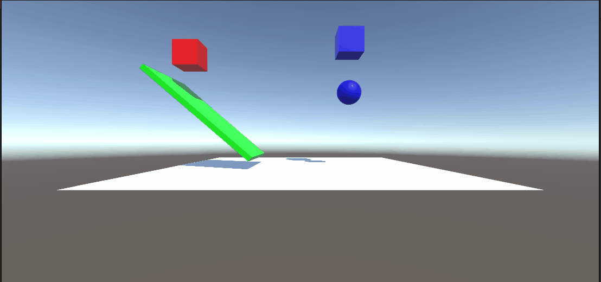
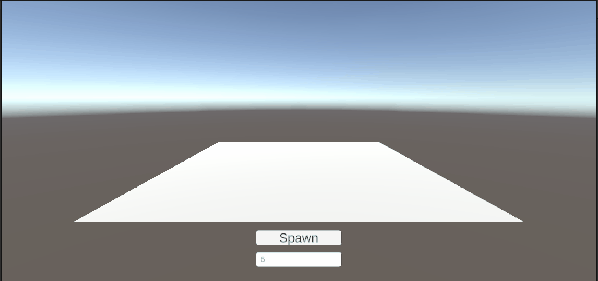

# Разработка игровых сервисов
Отчет по лабораторной работе #1 выполнил(а):
- Назаров Лев Сергеевич
- РИ-300012
Отметка о выполнении заданий (заполняется студентом):

| Задание | Выполнение | Баллы |
| ------ | ------ | ------ |
| Задание 1 | * | 60 |
| Задание 2 | * | 20 |
| Задание 3 | * | 20 |

знак "*" - задание выполнено; знак "#" - задание не выполнено;

Работу проверили:
- к.т.н., доцент Денисов Д.В.
- к.э.н., доцент Панов М.А.
- ст. преп., Фадеев В.О.

## Цель работы
Ознакомиться с основными функциями Unity и взаимодействием с объектами внутри редактора.

## Задание 1
### В разделе «ход работы» пошагово выполнить каждый пункт с описанием и примером реализации задач по теме видео самостоятельной работы
Ход работы:
1)	Создать новый проект из шаблона 3D – Core;
2)	Проверить, что настроена интеграция редактора Unity и Visual Studio Code (пункты 8-10 введения);
3)	Создать объект Plane;
4)	Создать объект Cube;
5)	Создать объект Sphere;
6)	Установить компонент Sphere Collider для объекта Sphere;
7)	Настроить Sphere Collider в роли триггера;
8)	Объект куб перекрасить в красный цвет;
9)	Добавить кубу симуляцию физики, при это куб не должен проваливаться под Plane;
10) Написать скрипт, который будет выводить в консоль сообщение о том, что объект Sphere столкнулся с объектом Cube;
11) При столкновении Cube должен менять свой цвет на зелёный, а при завершении столкновения обратно на красный.
```cs
public class SphereController : MonoBehaviour
{
    void Update()
    {
        transform.position = new Vector3(1 + Mathf.Sin(Time.timeSinceLevelLoad) * 2, 1);
    }

    private void OnTriggerEnter(Collider other)
    {
        if (other.name == "Cube")
        {
            other.gameObject.GetComponent<Renderer>().material.color = Color.green;
            Debug.Log("Sphere colliding with cube");
        }
    }

    private void OnTriggerExit(Collider other)
    {
        if (other.name == "Cube")
        {
            other.gameObject.GetComponent<Renderer>().material.color = Color.red;
        }
    }
}
```

## Задание 2
### Продемонстрируйте на сцене в Unity следующее:
### - Что произойдёт с координатами объекта, если он перестанет быть дочерним?
Ход работы:
1. Добавил к сфере дочернюю синюю шайбу.
2. Добавил в SphereController несколько строк.
```cs
public class SphereController : MonoBehaviour
{
    public GameObject Cylinder; // !
    void Update()
    {
        transform.position = new Vector3(1 + Mathf.Sin(Time.timeSinceLevelLoad) * 2, 1);
    }

    private void OnTriggerEnter(Collider other)
    {
        if (other.name == "Cube")
        {
            other.gameObject.GetComponent<Renderer>().material.color = Color.green;
            Debug.Log("Sphere colliding with cube");
            Cylinder.transform.parent = null; // !
        }
    }

    private void OnTriggerExit(Collider other)
    {
        if (other.name == "Cube")
        {
            other.gameObject.GetComponent<Renderer>().material.color = Color.red;
            Cylinder.transform.parent = transform; // !
        }
    }
}
```
Синяя шайба - дочерний объект зеленой сферы, который временно перестает быть дочерним при столкновении сферы с кубом.

### - Создайте три различных примера работы компонента RigidBody?
Ход работы:
1. Создал платформу.
2. Создал красный куб.
3. Создал зеленую платформу.
4. Создал синий куб и шар. 
5. Соединил синий куб и шар SpringJoint'ом.
Красный куб - динамическое тело, зеленый прямоугольник - кинематическое тело, а динамический синий шар соединен с кинематическим синим кубом Spring Joint'ом.

## Задание 3
### Реализуйте на сцене генерацию n кубиков. Число n вводится пользователем после старта сцены.
Ход работы:
1. Создал пустой объект CubeSpawner.
2. Создал скрипт CubeSpawner.cs и прикрепил к CubeSpawner'у. 
```cs
public class CubeSpawner : MonoBehaviour
{
    public GameObject SpawnedObject;
    public Button SpawnButton;
    public TMPro.TMP_InputField AmountInputField;
    public float SpawnInterval = 1;
    private float TimeAccumulator;
    private int SpawnAmount = 0;
    void Start()
    {
        SpawnButton.onClick.AddListener(SpawnButtonClick);
    }

    void Update()
    {
        TimeAccumulator += Time.deltaTime;
        if (SpawnAmount > 0 && TimeAccumulator > SpawnInterval)
        {
            TimeAccumulator = 0;
            var obj = Instantiate(SpawnedObject);
            obj.transform.position = transform.position;
            SpawnAmount -= 1;
        }
    }

    public void SpawnButtonClick()
    {
        SpawnAmount = int.Parse(AmountInputField.text);
    }
}
```

## Выводы
Все было сделано и все было узнано.

## Powered by

**BigDigital Team: Denisov | Fadeev | Panov**
